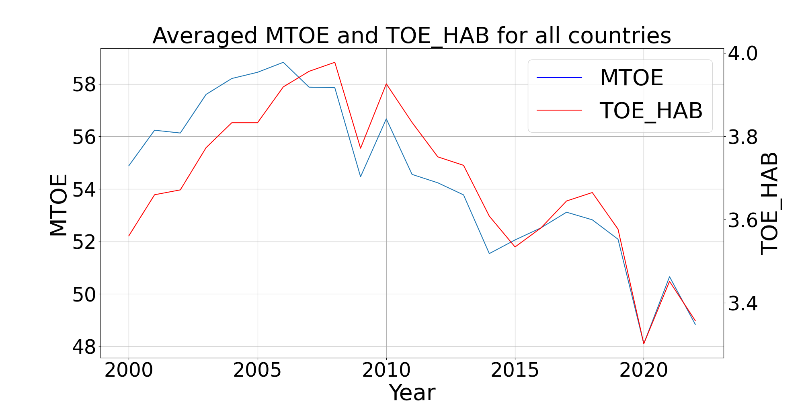

# Correlation Between Temperature Increase and Energy Consumption In European Countries

## Table of Contents
1. [Introduction and Motivation](#introduction-and-motivation)
2. [Project Description](#project-description)
3. [Datasets](#datasets)
4. [Project Structure](#project-structure)
5. [Instructions](#instructions)
6. [Data Pipeline](#data-pipeline)
7. [Analysis](#analysis)
8. [Contact Information](#contact-information)
9. [License](#license)

## Introduction and Motivation <a name="introduction-and-motivation"></a>
Climate change is a pressing global issue with significant implications for environmental, economic, and social systems. In Europe, rising temperatures have raised concerns about their potential impact on energy consumption patterns. This project aims to investigate whether there has been a noticeable increase in temperatures in European countries since the 2000s and how energy consumption has changed over this period. Understanding these trends is essential to address the main question: **Does a potential temperature increase correlate with energy consumption in Europe?**

## Project Description <a name="project-description"></a>
This project investigates the correlation between temperature increase and energy consumption in European countries. It follows a pipeline that includes data extraction, cleaning, transformation, and integration. A detailed description of the data origin preprocessing and preprocessing can be found in `project/data-report.pdf`. The final data is saved into `data/final_data.csv`. An analysis is then performed on the final data to answer the research question in `project/analysis-report.pdf`. The results of the analysis are saved into `plots/`.

## Datasets <a name="datasets"></a>
The project combines two datasets to analyze the trends and patterns:
1. **Climate Change Indicators**: Measures temperature change relative to a baseline climatology corresponding
to the period from 1951 to 1980. It is a CSV file and is licensed under CC0. [Source](https://www.kaggle.com/datasets/tarunrm09/climate-change-indicators)

2. **Primary Energy Consumption EU**: Provides data about the primary energy consumption in the EU.  The dataset is distributed by Eurostat, the statistical office of the European Union. The data format is CSV and it is licensed under the Open Data License. [Source](https://ec.europa.eu/eurostat/databrowser/view/sdg_07_10/default/table)

For more detailed information, see `project/data-report.pdf`.

## Project Structure <a name="project-structure"></a>

```
├───.github/
│   └───workflows/
├───data/
├───exercises/
├───plots/
├───project/
│	├───analysis-report.pdf
│	├───analysis.py
│	├───data-report.pdf
│	├───downloader.py
│	├───pipeline.py
│	├───pipeline.sh
│	├───preprocessing.py
│	├───project_plan.md
│	├───requirements.txt
│	├───tests.sh
│   	└───unit_tests.sh
└───sample_data/
	├───eurostat_sample.csv
   	└───kaggle_sample.csv
```

Important files:
- `project/pipeline.sh` or `project/pipeline.py`: Executes the pipeline and saves the data into `data/final_data.csv`. Make sure that the dependencies contained in `project/requirements.txt` are installed and that a Kaggle API key is installed on the system.
- `projects/analysis.py`: Analyses the data and saves the according plots into `plots/`.
- `project/data-report.pdf`: Provides a detailed overview of the original data and what changes are made to obtain the final data.
- `project/analysis-report.pdf`: Analysis of the research question.


## Instructions <a name="instructions"></a>
1. Clone the repository to your local machine with `git clone https://github.com/dennismstfc/FAU-MADE-project`.
2. Install the dependencies from `project/requirements.txt` using pip: `pip install -r project/requirements.txt`.
3. Make sure you have a Kaggle API key installed on your system. See the [documentation](https://www.kaggle.com/docs/api) for more.
4. Run the pipeline script: `python project/pipeline.py` or `sh project/pipeline.sh`.
5. Run the analysis script: `python projects/analysis.py`.

## Data Pipeline <a name="data-pipeline"></a>


## Analysis <a name="analysis"></a>
The analysis is divided into three main parts:

1. **Surface Temperature Trends** 
    - This plot illustrates the significant increase in surface temperatures across European countries since the 2000s. The rising trend line indicates a consistent warming pattern.

2. **Energy Consumption Patterns** 
    - Contrary to temperature trends, energy consumption data reveals a rise until 2007, followed by a subsequent decline. This pattern suggests that energy usage does not directly correspond with the observed temperature increases.

3. **Correlation Analysis** 
    - The correlation plot further reinforces our findings, indicating no significant relationship between the increase in temperatures and energy consumption in Europe.

For a more comprehensive understanding of these trends and their implications, please refer to the detailed report available at `project/analysis-report.pdf`.

##

---

## Contact Information <a name="contact-information"></a>
For any additional questions or comments, please contact me at dennis.mustafic@fau.de

## License <a name="license"></a>
This project is licensed under the terms of the CC-BY-4.0 license.
